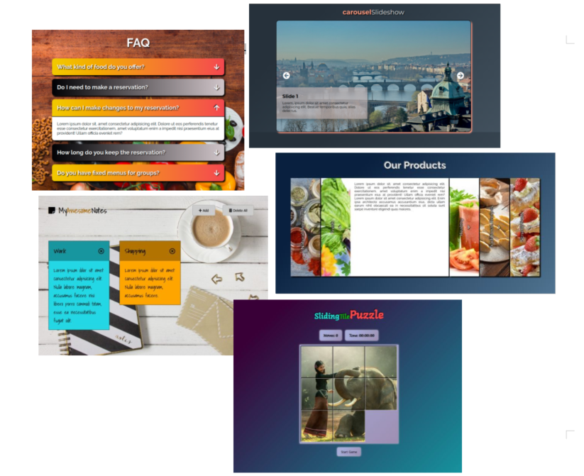

# jfdzr2-project-2

This is a 7 week long project done during my second module at InfoShare Academy. The project goal is to build at least two mini apps and a game using JavaScript. Over the course of the project I have built:

- [Feature 1 - Image Slider](https://malgorzata-niemczyk.github.io/jfdzr2-project-2/Project-2/image_slider/index.html)

- [Feature 2 - Vertical Accordion](https://malgorzata-niemczyk.github.io/jfdzr2-project-2/Project-2/accordion/index.html) and [Horizontal Accordion](https://malgorzata-niemczyk.github.io/jfdzr2-project-2/Project-2/horizontal-accordion/index.html)

- [Feature 3 - Notepad](https://malgorzata-niemczyk.github.io/jfdzr2-project-2/Project-2/notepad/index.html)

- [Game - Sliding Tile Puzzle](https://malgorzata-niemczyk.github.io/jfdzr2-project-2/Project-2/game_sliding-tile-puzzle/index.html)

