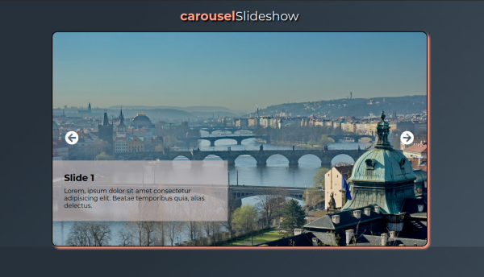
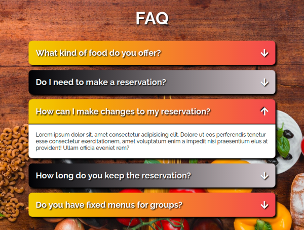
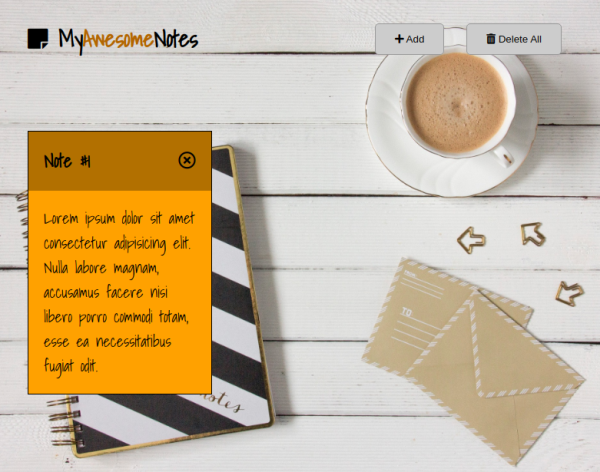

# jfdzr2-project-2

[Link to Feature 1](https://malgorzata-niemczyk.github.io/jfdzr2-project-2/Project-2/image_slider/index.html) - Image Slider

[Link to Feature 2](https://malgorzata-niemczyk.github.io/jfdzr2-project-2/Project-2/accordion/index.html) - Accordion

[Link to Feature 3](https://malgorzata-niemczyk.github.io/jfdzr2-project-2/Project-2/notepad/index.html) - Notepad (WIP)

This is a 7 week long project, on which I am currently working, during my second module at InfoShare Academy. The project goal is to build at least two mini apps and a game using JavaScript.

So far I have built an accordion and a slider.
